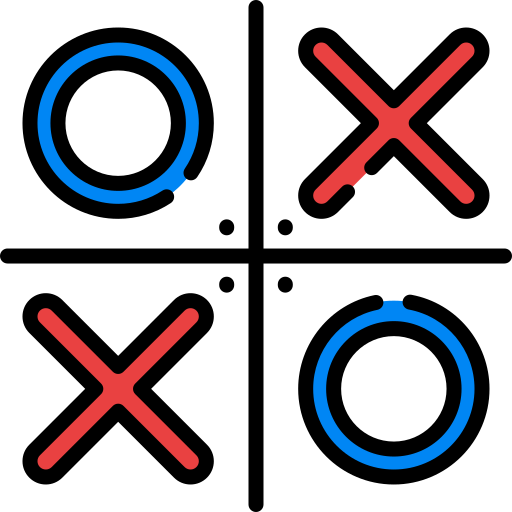

# Tic-Tac-Toe (Android)

<p align="center">
  
</p>

<p align="center">
  A clean, responsive 2-player Tic-Tac-Toe Android game built in Java. Features turn-based visual feedback, custom player names, and density-independent layouts.
</p>

<p align="center">
  <a href="https://github.com/RifatHossaiN47/Tic-Tac-Toe-Game/releases/download/v1.0.0/Tic-Tac-Toe.apk">
    
  </a>
</p>

---

## Overview

A native Android implementation of the classic 3x3 Tic-Tac-Toe game designed for quick pass-and-play matches between two players. Built with a focus on responsive layouts across varied screen sizes and clear visual state management.

## Key Highlights

- **Local 2-Player Match**: Supports custom player names passed across activities.
- **Dynamic Turn Feedback**: Active player is highlighted on each turn so players always know who goes next.
- **Win & Draw Detection**: Evaluates all 8 winning combinations (3 rows, 3 columns, 2 diagonals) and handles draw states automatically.
- **Game Over Dialog**: Quick popup showing the winner or draw with options to restart immediately or return to the setup screen.
- **Multi-Density UI**: Built using Intuit `sdp` and `ssp` libraries to ensure sizing and typography scale consistently from `hdpi` to `xxxhdpi` devices.
- **Orientation Lock**: Fixed in portrait mode to maintain consistent layout proportions.

## Tech Stack

| Category | Details |
|---|---|
| **Language** | Java (Java 8 compatibility) |
| **Minimum SDK** | API 24 (Android 7.0 Nougat) |
| **Target SDK** | API 33 (Android 13) |
| **UI** | Android XML (`ConstraintLayout`, `LinearLayout`) |
| **Libraries** | AndroidX AppCompat, Material Design Components, Intuit SDP & SSP |
| **Build Tool** | Gradle 8.0 / Android Gradle Plugin 8.0.1 |

## Project Structure

```
app/src/main/java/com/example/tictactoegame/
├── splash.java          # Launch screen with entrance animation
├── AddPlayers.java      # Player name input and validation
└── MainActivity.java    # Core game loop, win checking & result dialogs
```

## Running the Project

### Prerequisites
- Android Studio (Electric Eel or newer)
- JDK 17 (recommended for Gradle 8.0 compatibility)
- Android SDK API 33

### Steps
1. Clone the repository:
   ```bash
   git clone https://github.com/RifatHossaiN47/Tic-Tac-Toe-Game.git
   ```
2. Open the project folder in Android Studio.
3. Let Gradle sync dependencies.
4. Select an emulator or connected device and click **Run** (`Shift + F10`).

To generate a release APK from terminal:
```bash
./gradlew assembleRelease
```
The APK will be generated at `app/build/outputs/apk/release/`.

## Author

- **Rifat Hossain** — [GitHub Profile](https://github.com/RifatHossaiN47)

## License

This project is open for personal and educational use.
